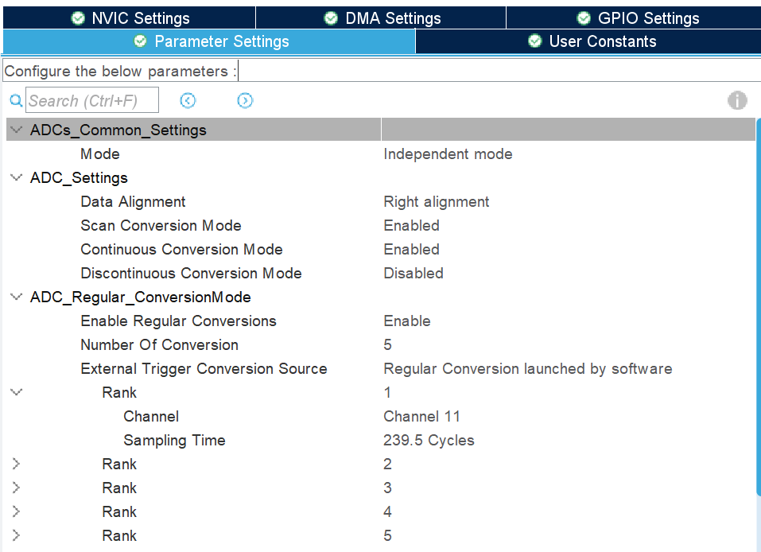

# 串口数据收发篇
## ①串口双缓存接收(空闲中断)

STMF103空闲中断双缓存接收，由于HAL库中未对空闲回调函数进行调用，使用时需在串口中断处理中进行调用并判断串口空闲标志位是否置位。
```c
uint8_t RecvBUff1[128] = {0};
uint8_t RecvBuff2[128] = {0};
uint8_t *active_buff = RecvBuff1;
uint8_t *passive_buff = RecvBuff2;

void HAL_UART_IdleCallback(UART_HandleTypeDef *huart)
{
    uint8_t cmd_id = 0;
    
    if((huart->Instance == USART3) && 
       (RESET != AL_UART_GET_FLAG(&huart3,UART_FLAG_IDLE)))
    {
        uint8_t *temp_buff = passive_buff；
        passive_buff = active_buff；
        active_buff = temp_buff；
            
        /*串口数据处理*/
            
       HAL_UART_Receive_DMA(&huart3，active_buff，128)；
    }
}

int main(void)
{
	HAL_UART_Receive_DMA(&huart3，active_buff，128)；    /*初始化开启串口DMA输出*/
    While(1)
    {
        
    }
}
```

## ②串口不定长度接收(中断+DMA)

使用“HAL_UARTEx_RxEventCallback”回调函数可以处理非固定长度的串口数据，但接收数据的数组需要足够大或者关闭过半中断，否则当一次接受的数据长度超过数组的一半时会再次触发中断；接收的指令格式建议: 帧头 + 数据长度 + 数据指令 + 帧尾；
```c
uint8_t RecvBUff[128] = {0};

void HAL_UARTEx_RxEventCallback(UART_HandleTypeDef *huart, uint16_t Size)
{
    if(huart->Instance == USART3)
    {
        HAL_UART_Transmit_DMA(&huart3，RecvBuff，Size)；
            
        /*
         *			处理接收数据
         */
        
        HAL_UARTEx_ReceiveToIdle_DMA(&huart3，RecvBUff，sizeof(RecvBuff))；
        __HAL_DMA_DISABLE_IT(&hdma_usart3_rx,DMA_IT_HT)；
    }
}

int main(void)
{
    HAL_UARTEx_ReceiveToIdle_DMA(&huart3，RecvBUff，sizeof(RecvBuff))；
    __HAL_DMA_DISABLE_IT(&hdma_usart3_rx,DMA_IT_HT)；				//关闭过半中断
        
    while(1)
    {
        
    }
}
```

## ③ 串口接收数据处理

配合②进行数据处理

```c
// 指令的最小长度  
#define COMMAND_MIN_LENGTH 4  
  
// 循环缓冲区大小  
#define BUFFER_SIZE 128  
// 循环缓冲区  
uint8_t buffer[BUFFER_SIZE];  
// 循环缓冲区读索引  
uint8_t readIndex = 0;  
// 循环缓冲区写索引  
uint8_t writeIndex = 0;  
  
/**  
* @brief 增加读索引  
* @param length 要增加的长度  
*/  
void Command_AddReadIndex(uint8_t length) {  
	readIndex += length;  
	readIndex %= BUFFER_SIZE;  
}  
  
/**  
* @brief 读取第i位数据 超过缓存区长度自动循环  
* @param i 要读取的数据索引  
*/  
  
uint8_t Command_Read(uint8_t i) {  
	uint8_t index = i % BUFFER_SIZE;  
	return buffer[index];  
}  
  
/**  
* @brief 计算未处理的数据长度  
* @return 未处理的数据长度  
* @retval 0 缓冲区为空  
* @retval 1~BUFFER_SIZE-1 未处理的数据长度  
* @retval BUFFER_SIZE 缓冲区已满  
*/  
//uint8_t Command_GetLength() {  
// // 读索引等于写索引时，缓冲区为空  
// if (readIndex == writeIndex) {  
// return 0;  
// }  
// // 如果缓冲区已满,返回BUFFER_SIZE  
// if (writeIndex + 1 == readIndex || (writeIndex == BUFFER_SIZE - 1 && readIndex == 0)) {  
// return BUFFER_SIZE;  
// }  
// // 如果缓冲区未满,返回未处理的数据长度  
// if (readIndex <= writeIndex) {  
// return writeIndex - readIndex;  
// } else {  
// return BUFFER_SIZE - readIndex + writeIndex;  
// }  
//}  
  
uint8_t Command_GetLength() {  
	return (writeIndex + BUFFER_SIZE - readIndex) % BUFFER_SIZE;  
}  
  
  
/**  
* @brief 计算缓冲区剩余空间  
* @return 剩余空间  
* @retval 0 缓冲区已满  
* @retval 1~BUFFER_SIZE-1 剩余空间  
* @retval BUFFER_SIZE 缓冲区为空  
*/  
uint8_t Command_GetRemain() {  
	return BUFFER_SIZE - Command_GetLength();  
}  
  
/**  
* @brief 向缓冲区写入数据  
* @param data 要写入的数据指针  
* @param length 要写入的数据长度  
* @return 写入的数据长度  
*/  
uint8_t Command_Write(uint8_t *data, uint8_t length) {  
	// 如果缓冲区不足 则不写入数据 返回0  
	if (Command_GetRemain() < length) {  
		return 0;  
	}  
	// 使用memcpy函数将数据写入缓冲区  
	if (writeIndex + length < BUFFER_SIZE) {  
		memcpy(buffer + writeIndex, data, length);  
		writeIndex += length;  
	} else {  
		uint8_t firstLength = BUFFER_SIZE - writeIndex;  
		memcpy(buffer + writeIndex, data, firstLength);  
		memcpy(buffer, data + firstLength, length - firstLength);  
		writeIndex = length - firstLength;  
	}  
	return length;  
}  
  
/**  
* @brief 尝试获取一条指令  
* @param command 指令存放指针  
* @return 获取的指令长度  
* @retval 0 没有获取到指令  
*/  
uint8_t Command_GetCommand(uint8_t *command) 
{  
	// 寻找完整指令  
	while (1) {  
	// 如果缓冲区长度小于COMMAND_MIN_LENGTH 则不可能有完整的指令  
		if (Command_GetLength() < COMMAND_MIN_LENGTH) {  
			return 0;  
		}  
		// 如果不是包头 则跳过 重新开始寻找  
		if (Command_Read(readIndex) != 0xAA) {  
			Command_AddReadIndex(1);  
			continue;  
		}  
		// 如果缓冲区长度小于指令长度 则不可能有完整的指令  
		uint8_t length = Command_Read(readIndex + 1);  
		if (Command_GetLength() < length) {  
			return 0;  
		}  
		// 如果校验和不正确 则跳过 重新开始寻找  
		uint8_t sum = 0;  
		for (uint8_t i = 0; i < length - 1; i++) {  
			sum += Command_Read(readIndex + i);  
		}  
		if (sum != Command_Read(readIndex + length - 1)) {  
			Command_AddReadIndex(1);  
			continue;  
		}  
		// 如果找到完整指令 则将指令写入command 返回指令长度  
		for (uint8_t i = 0; i < length; i++) {  
			command[i] = Command_Read(readIndex + i);  
		}  
		Command_AddReadIndex(length);  
		return length;  
	}  
}
```

# ADC采样篇

## ①  ADC多通道常规采样 + DMA

### 1、ADC配置

$\color{red}{Data Alignment：默认数据对其方式为 Right alignment(右对齐)，设置为左对齐需采样时移动数据}$
$\color{red}{Samling Time：数值越高采样精度越高；一般电压采样13.5左右温度，采样239.5以上。}$
### 2、DMA配置

$\color{red}{数据长度：Half Word 两字节 。ADC分辨率12位，采用Word需要对数据进行拆解}$
### 3、代码实现
#### 初始化ADC
```c
void DevADC1Func_Init(void)
{
	//ADC标定
	HAL_ADCEx_Calibration_Start(&hadc1);
	//启动DMA
	HAL_ADC_Start_DMA(&hadc1, (uint32_t *)ADC1SampleVal, DEV_LEN);
}
```
$\color{red}{由于DMA模式是循环模式，数据会不间断进来}$
#### ADC采样数据处理
```c
void DevADC1Func_Main(void)
{
	//计算ADC参考偏差
	//单片机内部有个精准的1.2V参照电压，可通过参照电压计算参考电压的偏差(温度计算不适用)
	float gain = ADC1SampleVal[4] * 3.3f / 4095.0f / 1.2f
	//计算单片机内部温度传感器的采样电压
	float CoreVol = ADC1SampleVal[3] * 3.3 / 4095.0f / gain
	//T = ((V25 - Vsense) / Avg_Slope) + 25
	float CoreTemperature = (1.43 - CoreVol) / 0.0043f + 25.0f;
}	
```

#### NTC温度传感器查表函数
```c
/*
 *param: u0      NTC当前电阻值
 *param: bp0[]   对应的电阻值表
 *param: table[] 对应的温度值表
 *param: maxIndex-表的最大元素数量
 *retval: 查表后的温度值
 */
float look1_iflf_binlxpw(float u0, const float bp0[], const float table[], uint32_t maxIndex)
{
	float frac;
	uint32_t iRght;
	uint32_t iLeft;
	uint32_t bpIdx;

	if (u0 <= bp0[0U])
	{
		iLeft = 0U;
		frac = (u0 - bp0[0U]) / (bp0[1U] - bp0[0U]);
	}else if (u0 < bp0[maxIndex])
	{
		/* Binary Search */
		bpIdx = maxIndex >> 1U;
		iLeft = 0U;
		iRght = maxIndex;
		while (iRght - iLeft > 1U)
		{
			if (u0 < bp0[bpIdx])
			{
				iRght = bpIdx;
			}else
			{
				iLeft = bpIdx;
			}
			bpIdx = (iRght + iLeft) >> 1U;
		}
		frac = (u0 - bp0[iLeft]) / (bp0[iLeft + 1U] - bp0[iLeft]);
	}else
	{
		iLeft = maxIndex - 1U;
		frac = (u0 - bp0[maxIndex - 1U]) / (bp0[maxIndex] - bp0[maxIndex - 1U]);
	}
	
	return (table[iLeft + 1U] - table[iLeft]) * frac + table[iLeft];
}
```

# 定时器PWM输出篇

## ① PWM输出频率占空比动态可调

### 1、定时器配置

### 2、代码实现
```c

/*
* @brief
* @param pulsetime:脉冲周期时间
* @param dutycycle:脉冲占空比
* @retval none
* @func 调节脉冲时间和占空比
*/

static uint32_t DevPwm_SetPulseFreq(uint8_t ch,uint32_t pulsetime,uint8_t duty)
{
	uint32_t input_freq, out_prescaler_value, out_count_value,pluse;
	uint32_t channel;
	TIM_HandleTypeDef *p_handle;
	
	channel = dev_ultra_handle[ch].Channel;
	p_handle = dev_ultra_handle[ch].Handle;
	input_freq = 10000 / pulsetime;
	
	if((input_freq > MAX_OUTPUT_FREQ) || (input_freq < MIN_OUTPUT_FREQ))
	{
		return 0;
	}

	if((input_freq >= 20) && (input_freq <= 10000))
	{
		out_prescaler_value = 720-1;
		out_count_value = 1000000 / input_freq;
	}else if((input_freq >= 2) && (input_freq < 20))
	{
		out_prescaler_value = 7200-1;
		out_count_value = 100000 / input_freq;
	}else
	{
		return 0;
	}
	// 停止定时器
	HAL_TIM_PWM_Stop(p_handle, channel);
	HAL_TIM_Base_Stop(p_handle);
	
	__HAL_TIM_SET_PRESCALER(p_handle, out_prescaler_value);//更新预分频
	__HAL_TIM_SetAutoreload(p_handle, out_count_value);    //更新计数周期
	
	pluse = out_count_value * duty / 100;                  //计算当前占空比下的脉冲值
	__HAL_TIM_SetCompare(p_handle, channel, pluse);         
	// 更新并启动定时器
	HAL_TIM_Base_Start(p_handle);
	HAL_TIM_PWM_Start(p_handle, channel);
	
	return out_count_value;
}
```

# Flash数据记录篇

## ①  传统Flash操作(循环记录)
$\color{red}{**代码实现**}$
```c
#define FLASH_SLAVE_START     0x0800F000    //记录数据的起始地址
#define PAGE_SIZE             2048*2        //记录数据的地址长度
#define DATA_LENTH            16

uint32_t FlashOffset = 0;
uint16_t Buff[DATA_LENTH];
/*
 * @ brief 向flash写入数据---以STM32F103为例 
 * @ param addr  写入地址
 * @ param buff  写入数据
 * @ param len   数据长度
 * @ retval status 写入状态
 */
HAL_StatusTypeDef DevFlash_Write(uint32_t addr,uint16_t *buff,uint8_t len)
{
	uint8_t tag_i= 0;
	uint16_t writedata = 0;
	uint32_t writeaddr = addr;
	HAL_StatusTypeDef status = HAL_BUSY;
	//闪存解锁
	HAL_FLASH_Unlock();
	
	for(tag_i = 0;tag_i < len;tag_i++)
	{
		writedata = buff[tag_i];
		status = HAL_FLASH_Program(FLASH_TYPEPROGRAM_HALFWORD, writeaddr, (uint64_t)writedata);
		if(status != HAL_OK)
		{
			HAL_FLASH_Lock();
			return status;
		}else
		{
			writeaddr += 2;
		}
	}
	//闪存锁定
	HAL_FLASH_Lock();
	return status;
}

/* 
 * @brief 从flash中读取数据
 * @param addr  数据读取地址
 * @param buff  数据缓存区
 * @param len   数据长度
 */
void DevFlash_Read(uint32_t addr,uint16_t* buff,uint16_t len)
{
	uint8_t tag_i = 0;
	uint32_t readaddr = 0;
	//解锁闪存
	HAL_FLASH_Unlock();
	
	readaddr = addr;
	for(tag_i = 0;tag_i < len;tag_i++)
	{
		*(buff + tag_i) = *(volatile uint32_t *)readaddr;
		readaddr += 2;
	}
	
	HAL_FLASH_Lock();
}

void DevParam_Init()
{
	uint32_t read_addr = FLASH_SLAVE_START     //从起始地址开始读数据

	while(read_addr <= (FLASH_SLAVE_START + PAGE_SIZE))
	{
		DevFlash_Read(read_addr,Buff,DATA_LENTH);
		/*轮询查找未写入数据的地址*/
		if(((uint32_t)Buff[0] << 16 | Buff[1]) != 0xFFFFFFFF)
		{
			FlashOffset += (PAGE_SIZE * 2);
			read_addr = FLASH_SLAVE_START + FlashOffset;
		}else  /*找到未写入数据的地址后 读取上一次地址的数据(最后一次记录数据的地址)*/
		{
		     //Flash第一次写入数据
			if(read_addr == FLASH_SLAVE_START)
			{
				Buff[0] = 0;
				Buff[1] = 0;    //记录写入次数
				break;
			}
			FlashOffset -= (PAGE_SIZE * 2);
			read_addr = FLASH_SLAVE_START + FlashOffset;
			DevFlash_Read(read_addr,Buff,DATA_LENTH);
			break;
		}
	}

}
```

## ② FlashDB-超轻量级嵌入式数据库

详细见《[FlashDB移植笔记](FlashDB移植笔记.md)》
# LVGL移植篇
[LVGL移植](LVGL移植.md)
# 算法篇

## ① MD5加密算法

### 1、获取单片机内部UID

```c
uint32_t UID[3] = {0};

void GetSTM32F103_UID(void)
{
	UID[0] = HAL_GetUIDw0();
    UID[1] = HAL_GetUIDw1();
    UID[2] = HAL_GetUIDw2();
}
```
### 2、MD5代码实现
MD5.h
```c
#ifndef MD5_H
#define MD5_H
 
typedef struct
{
    unsigned int count[2];
    unsigned int state[4];
    unsigned char buffer[64];   
}MD5_CTX;
 
                         
#define F(x,y,z) ((x & y) | (~x & z))
#define G(x,y,z) ((x & z) | (y & ~z))
#define H(x,y,z) (x^y^z)
#define I(x,y,z) (y ^ (x | ~z))
#define ROTATE_LEFT(x,n) ((x << n) | (x >> (32-n)))
#define FF(a,b,c,d,x,s,ac) \
          { \
          a += F(b,c,d) + x + ac; \
          a = ROTATE_LEFT(a,s); \
          a += b; \
          }
#define GG(a,b,c,d,x,s,ac) \
          { \
          a += G(b,c,d) + x + ac; \
          a = ROTATE_LEFT(a,s); \
          a += b; \
          }
#define HH(a,b,c,d,x,s,ac) \
          { \
          a += H(b,c,d) + x + ac; \
          a = ROTATE_LEFT(a,s); \
          a += b; \
          }
#define II(a,b,c,d,x,s,ac) \
          { \
          a += I(b,c,d) + x + ac; \
          a = ROTATE_LEFT(a,s); \
          a += b; \
          }                                            
void MD5Init(MD5_CTX *context);
void MD5Update(MD5_CTX *context,unsigned char *input,unsigned int inputlen);
void MD5Final(MD5_CTX *context,unsigned char digest[16]);
void MD5Transform(unsigned int state[4],unsigned char block[64]);
void MD5Encode(unsigned char *output,unsigned int *input,unsigned int len);
void MD5Decode(unsigned int *output,unsigned char *input,unsigned int len);
 
#endif
```

MD5.c
```c
#include <stdio.h>
#include <stdlib.h>
#include <string.h>
#include <unistd.h>
#include "md5.h"

unsigned char PADDING[]={0x80,0,0,0,0,0,0,0,0,0,0,0,0,0,0,0,
                         0,0,0,0,0,0,0,0,0,0,0,0,0,0,0,0,
                         0,0,0,0,0,0,0,0,0,0,0,0,0,0,0,0,
                         0,0,0,0,0,0,0,0,0,0,0,0,0,0,0,0};
                         
void MD5Init(MD5_CTX *context)
{
     context->count[0] = 0;
     context->count[1] = 0;
     context->state[0] = 0x67452301;
     context->state[1] = 0xEFCDAB89;
     context->state[2] = 0x98BADCFE;
     context->state[3] = 0x10325476;
}
void MD5Update(MD5_CTX *context,unsigned char *input,unsigned int inputlen)
{
    unsigned int i = 0,index = 0,partlen = 0;
    index = (context->count[0] >> 3) & 0x3F;
    partlen = 64 - index;
    context->count[0] += inputlen << 3;
    if(context->count[0] < (inputlen << 3))
       context->count[1]++;
    context->count[1] += inputlen >> 29;
    
    if(inputlen >= partlen)
    {
       memcpy(&context->buffer[index],input,partlen);
       MD5Transform(context->state,context->buffer);
       for(i = partlen;i+64 <= inputlen;i+=64)
           MD5Transform(context->state,&input[i]);
       index = 0;        
    }  
    else
    {
        i = 0;
    }
    memcpy(&context->buffer[index],&input[i],inputlen-i);
}
void MD5Final(MD5_CTX *context,unsigned char digest[16])
{
    unsigned int index = 0,padlen = 0;
    unsigned char bits[8];
    index = (context->count[0] >> 3) & 0x3F;
    padlen = (index < 56)?(56-index):(120-index);
    MD5Encode(bits,context->count,8);
    MD5Update(context,PADDING,padlen);
    MD5Update(context,bits,8);
    MD5Encode(digest,context->state,16);
}
void MD5Encode(unsigned char *output,unsigned int *input,unsigned int len)
{
    unsigned int i = 0,j = 0;
    while(j < len)
    {
        output[j] = input[i] & 0xFF;  
        output[j+1] = (input[i] >> 8) & 0xFF;
        output[j+2] = (input[i] >> 16) & 0xFF;
        output[j+3] = (input[i] >> 24) & 0xFF;
        i++;
        j+=4;
    }
}
void MD5Decode(unsigned int *output,unsigned char *input,unsigned int len)
{
     unsigned int i = 0,j = 0;
     while(j < len)
     {
        output[i] = (input[j]) |
                    (input[j+1] << 8) |
                    (input[j+2] << 16) |
                    (input[j+3] << 24);
        i++;
        j+=4; 
     }
}
void MD5Transform(unsigned int state[4],unsigned char block[64])
{
    unsigned int a = state[0];
    unsigned int b = state[1];
    unsigned int c = state[2];
    unsigned int d = state[3];
    unsigned int x[64];
    MD5Decode(x,block,64);
    FF(a, b, c, d, x[ 0], 7, 0xd76aa478); /* 1 */
    FF(d, a, b, c, x[ 1], 12, 0xe8c7b756); /* 2 */
    FF(c, d, a, b, x[ 2], 17, 0x242070db); /* 3 */
    FF(b, c, d, a, x[ 3], 22, 0xc1bdceee); /* 4 */
    FF(a, b, c, d, x[ 4], 7, 0xf57c0faf); /* 5 */
    FF(d, a, b, c, x[ 5], 12, 0x4787c62a); /* 6 */
    FF(c, d, a, b, x[ 6], 17, 0xa8304613); /* 7 */
    FF(b, c, d, a, x[ 7], 22, 0xfd469501); /* 8 */
    FF(a, b, c, d, x[ 8], 7, 0x698098d8); /* 9 */
    FF(d, a, b, c, x[ 9], 12, 0x8b44f7af); /* 10 */
    FF(c, d, a, b, x[10], 17, 0xffff5bb1); /* 11 */
    FF(b, c, d, a, x[11], 22, 0x895cd7be); /* 12 */
    FF(a, b, c, d, x[12], 7, 0x6b901122); /* 13 */
    FF(d, a, b, c, x[13], 12, 0xfd987193); /* 14 */
    FF(c, d, a, b, x[14], 17, 0xa679438e); /* 15 */
    FF(b, c, d, a, x[15], 22, 0x49b40821); /* 16 */
 
    /* Round 2 */
    GG(a, b, c, d, x[ 1], 5, 0xf61e2562); /* 17 */
    GG(d, a, b, c, x[ 6], 9, 0xc040b340); /* 18 */
    GG(c, d, a, b, x[11], 14, 0x265e5a51); /* 19 */
    GG(b, c, d, a, x[ 0], 20, 0xe9b6c7aa); /* 20 */
    GG(a, b, c, d, x[ 5], 5, 0xd62f105d); /* 21 */
    GG(d, a, b, c, x[10], 9,  0x2441453); /* 22 */
    GG(c, d, a, b, x[15], 14, 0xd8a1e681); /* 23 */
    GG(b, c, d, a, x[ 4], 20, 0xe7d3fbc8); /* 24 */
    GG(a, b, c, d, x[ 9], 5, 0x21e1cde6); /* 25 */
    GG(d, a, b, c, x[14], 9, 0xc33707d6); /* 26 */
    GG(c, d, a, b, x[ 3], 14, 0xf4d50d87); /* 27 */
    GG(b, c, d, a, x[ 8], 20, 0x455a14ed); /* 28 */
    GG(a, b, c, d, x[13], 5, 0xa9e3e905); /* 29 */
    GG(d, a, b, c, x[ 2], 9, 0xfcefa3f8); /* 30 */
    GG(c, d, a, b, x[ 7], 14, 0x676f02d9); /* 31 */
    GG(b, c, d, a, x[12], 20, 0x8d2a4c8a); /* 32 */

    /* Round 3 */
    HH(a, b, c, d, x[ 5], 4, 0xfffa3942); /* 33 */
    HH(d, a, b, c, x[ 8], 11, 0x8771f681); /* 34 */
    HH(c, d, a, b, x[11], 16, 0x6d9d6122); /* 35 */
    HH(b, c, d, a, x[14], 23, 0xfde5380c); /* 36 */
    HH(a, b, c, d, x[ 1], 4, 0xa4beea44); /* 37 */
    HH(d, a, b, c, x[ 4], 11, 0x4bdecfa9); /* 38 */
    HH(c, d, a, b, x[ 7], 16, 0xf6bb4b60); /* 39 */
    HH(b, c, d, a, x[10], 23, 0xbebfbc70); /* 40 */
    HH(a, b, c, d, x[13], 4, 0x289b7ec6); /* 41 */
    HH(d, a, b, c, x[ 0], 11, 0xeaa127fa); /* 42 */
    HH(c, d, a, b, x[ 3], 16, 0xd4ef3085); /* 43 */
    HH(b, c, d, a, x[ 6], 23,  0x4881d05); /* 44 */
    HH(a, b, c, d, x[ 9], 4, 0xd9d4d039); /* 45 */
    HH(d, a, b, c, x[12], 11, 0xe6db99e5); /* 46 */
    HH(c, d, a, b, x[15], 16, 0x1fa27cf8); /* 47 */
    HH(b, c, d, a, x[ 2], 23, 0xc4ac5665); /* 48 */

    /* Round 4 */
    II(a, b, c, d, x[ 0], 6, 0xf4292244); /* 49 */
    II(d, a, b, c, x[ 7], 10, 0x432aff97); /* 50 */
    II(c, d, a, b, x[14], 15, 0xab9423a7); /* 51 */
    II(b, c, d, a, x[ 5], 21, 0xfc93a039); /* 52 */
    II(a, b, c, d, x[12], 6, 0x655b59c3); /* 53 */
    II(d, a, b, c, x[ 3], 10, 0x8f0ccc92); /* 54 */
    II(c, d, a, b, x[10], 15, 0xffeff47d); /* 55 */
    II(b, c, d, a, x[ 1], 21, 0x85845dd1); /* 56 */
    II(a, b, c, d, x[ 8], 6, 0x6fa87e4f); /* 57 */
    II(d, a, b, c, x[15], 10, 0xfe2ce6e0); /* 58 */
    II(c, d, a, b, x[ 6], 15, 0xa3014314); /* 59 */
    II(b, c, d, a, x[13], 21, 0x4e0811a1); /* 60 */
    II(a, b, c, d, x[ 4], 6, 0xf7537e82); /* 61 */
    II(d, a, b, c, x[11], 10, 0xbd3af235); /* 62 */
    II(c, d, a, b, x[ 2], 15, 0x2ad7d2bb); /* 63 */
    II(b, c, d, a, x[ 9], 21, 0xeb86d391); /* 64 */
    state[0] += a;
    state[1] += b;
    state[2] += c;
    state[3] += d;
}

void main( void ) 
{ 
    int read_len;
    int i ;
    char temp[16]={0};
    unsigned int uid_data[3] = {0x066AFF30, 0x35505030, 0x43243328};
    unsigned char decrypt[16]={0};  
    unsigned char decrypt32[64]={0};    
    unsigned char decrypt32_temp[64]={0}; 
    
    MD5_CTX md5c; 

    for(i=0;i<3;i++)
    {
        sprintf(temp,"%08X",uid_data[i]);
        //itoa(uid_data[i],temp,16);
        strcat((char *)decrypt32,temp);
        printf("decrypt32 = %s\n",decrypt32);
    }

    MD5Init(&md5c); //初始化
    read_len = strlen((const char*)decrypt32);
    MD5Update(&md5c,(unsigned char *)decrypt32,read_len);  
  
    MD5Final(&md5c,decrypt); 
    strcpy((char *)decrypt32_temp,"");

    for(i=0;i<16;i++)
    {
        sprintf(temp,"%02x",decrypt[i]);
        strcat((char *)decrypt32_temp,temp);
    }

    while(1)
    {
        printf("md5:%s\n",decrypt32_temp);
        printf("read_len = %d\n",read_len);
        sleep(5);
    }

    return;
}
```
## ② PID控制器算法

```c
#include <stdio.h>
#include <math.h>
#include <time.h>

// PID控制器结构体
typedef struct {
    // 用户可调参数
    double Kp;          // 比例增益
    double Ki;          // 积分增益
    double Kd;          // 微分增益
    double tau;         // 微分滤波器时间常数
    double T;           // 采样时间(s)
    double out_min;     // 输出下限
    double out_max;     // 输出上限
    
    // 运行状态变量
    double integral;    // 积分项累积
    double prev_error;  // 上一次误差
    double prev_meas;   // 上一次测量值
    double prev_set;    // 上一次设定值
    double derivative;  // 滤波后的微分值
    double output;      // 当前输出值
    
    // 设定值平滑参数
    double set_smooth;  // 设定值平滑因子
} PIDController;

// 初始化PID控制器
void PID_Init(PIDController *pid, double Kp, double Ki, double Kd, double T) {
    pid->Kp = Kp;
    pid->Ki = Ki;
    pid->Kd = Kd;
    pid->T = T;
    pid->tau = 0.1;         // 默认微分滤波器常数
    pid->out_min = -100.0;   // 默认输出下限
    pid->out_max = 100.0;    // 默认输出上限
    pid->set_smooth = 0.2;   // 默认设定值平滑因子
    
    pid->integral = 0.0;
    pid->prev_error = 0.0;
    pid->prev_meas = 0.0;
    pid->prev_set = 0.0;
    pid->derivative = 0.0;
    pid->output = 0.0;
}

// 更新PID控制器状态
double PID_Update(PIDController *pid, double setpoint, double measurement) {
    // 1. 设定值平滑处理（防止设定值突变）
    double smooth_set = pid->set_smooth * setpoint + (1 - pid->set_smooth) * pid->prev_set;
    pid->prev_set = smooth_set;
    
    // 2. 计算误差项
    double error = smooth_set - measurement;
    
    // 3. 比例项
    double proportional = pid->Kp * error;
    
    // 4. 积分项（带抗饱和处理）
    pid->integral += pid->Ki * error * pid->T;
    
    // 积分抗饱和：限制积分累积范围
    if (pid->integral > pid->out_max) 
        pid->integral = pid->out_max;
    else if (pid->integral < pid->out_min) 
        pid->integral = pid->out_min;
    
    // 5. 微分项（带低通滤波）
    double raw_derivative = (measurement - pid->prev_meas) / pid->T;
    pid->derivative = (2.0 * pid->Kd * raw_derivative + (2.0 * pid->tau - pid->T) * pid->derivative) /
                     (2.0 * pid->tau + pid->T);
    
    // 6. 计算输出
    pid->output = proportional + pid->integral - pid->derivative;
    
    // 7. 输出限幅
    if (pid->output > pid->out_max) 
        pid->output = pid->out_max;
    else if (pid->output < pid->out_min) 
        pid->output = pid->out_min;
    
    // 8. 保存当前状态
    pid->prev_error = error;
    pid->prev_meas = measurement;
    
    return pid->output;
}

// 设置输出限幅
void PID_SetLimits(PIDController *pid, double min, double max) {
    pid->out_min = min;
    pid->out_max = max;
    
    // 确保积分项不超出新限幅
    if (pid->integral > pid->out_max) 
        pid->integral = pid->out_max;
    else if (pid->integral < pid->out_min) 
        pid->integral = pid->out_min;
}

// 重置控制器状态
void PID_Reset(PIDController *pid) {
    pid->integral = 0.0;
    pid->prev_error = 0.0;
    pid->prev_meas = 0.0;
    pid->derivative = 0.0;
    pid->output = 0.0;
}

// 示例应用：模拟温度控制系统
int main() {
    PIDController temp_pid;
    
    // 初始化PID参数：Kp=2.0, Ki=0.5, Kd=1.0, 采样时间0.1s
    PID_Init(&temp_pid, 2.0, 0.5, 1.0, 0.1);
    PID_SetLimits(&temp_pid, 0.0, 100.0);  // 输出范围0-100%
    
    double setpoint = 50.0;     // 目标温度50°C
    double temperature = 25.0;  // 当前温度25°C
    
    // 模拟100次控制循环
    for (int i = 0; i < 100; i++) {
        // 计算控制输出（加热器功率百分比）
        double output = PID_Update(&temp_pid, setpoint, temperature);
        
        // 模拟系统响应（简化的热力学模型）
        temperature += 0.3 * output - 0.1 * (temperature - 25.0);
        
        // 添加随机噪声
        temperature += ((rand() % 100) / 100.0 - 0.5);
        
        printf("Step %d: Set=%.1f, Temp=%.1f, Output=%.1f%%\n", 
               i+1, setpoint, temperature, output);
        
        // 每20步改变一次设定值
        if (i == 20) setpoint = 60.0;
        if (i == 60) setpoint = 40.0;
    }
    
    return 0;
}
```
# printf重定向篇

## ① 配置串口


## ② 添加代码

```c
#include "stdio.h"

#ifdef __GNUC__
#define PUTCHAR_PROTOTYPE int __io_putchar(int ch)
#else
#define PUTCHAR_PROTOTYPE int fputc(int ch, FILE *f)
#endif

PUTCHAR_PROTOTYPE
{
	HAL_UART_Transmit(&huart2, (uint8_t*)&ch,1,HAL_MAX_DELAY);
    return ch;
}
```

## ③ 打印浮点型

	选中项目(右键点击)---> Properties ---> C/C++ Build(下拉) 
	---> Settings ---> MCU/MPU Settings --->勾选(-u _printf_float)
